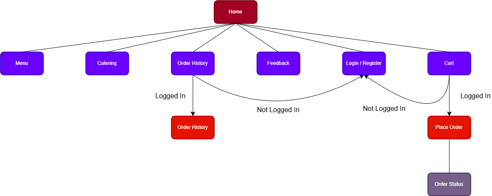
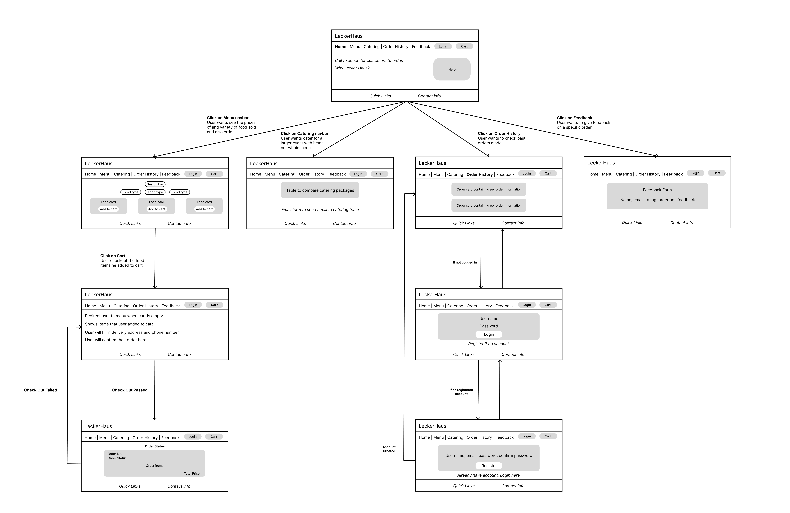
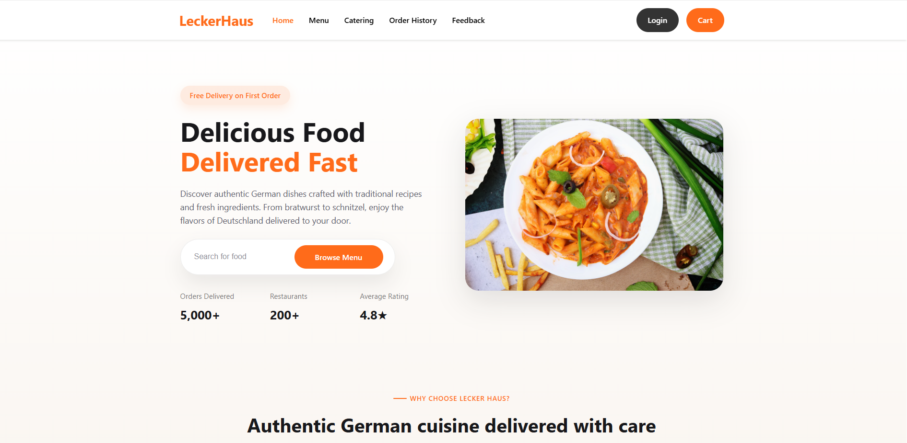
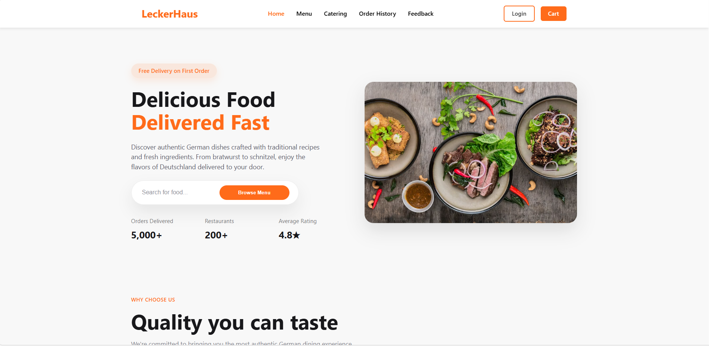

# Food Web App - IE4727

A restaurant ordering system built with two implementations: PHP and React.

**Choose Your Version:**
- [PHP Version](./food-web-app-php/README.md) - Server-side rendering with form submissions
- [React Version](./food-web-app/README.md) - Single Page Application with REST API

## Quick Start Guide

### Prerequisites
- [XAMPP](https://www.apachefriends.org/) installed (includes Apache, MySQL, PHP)
- [Node.js](https://nodejs.org/) (v16 or higher) - only for Modern version
- Web browser

---

## Installation

### Step 1: Clone/Download the Project
Place the entire `Food-Web-App_IE4727` folder in your XAMPP directory:
```
C:\xampp\htdocs\Food-Web-App_IE4727
```

### Step 2: Set Up Database
1. Open XAMPP Control Panel
2. Start **Apache** and **MySQL**
3. Open phpMyAdmin: `http://localhost/phpmyadmin`
4. Create a new database named `food_web_app`
5. Import the schema (choose one):
   - Option A: `food-web-app-php/database/schema.sql`
   - Option B: `food-web-app/backend/database/schema.sql`
   - (Both are identical - only import once!)
6. Import seed data:
   - For sample menu items and test users: `food-web-app-php/database/seed_data.sql`
   - Or: `food-web-app/backend/database/seed_data.sql`

---

## Running the Applications

### Option 1: Traditional PHP Version (food-web-app-php)

**No additional setup required!**

1. Ensure XAMPP Apache and MySQL are running
2. Open your browser and go to:
   ```
   http://localhost/Food-Web-App_IE4727/food-web-app-php/
   ```

**Key Features:**
- Server-side rendering with PHP
- Form-based interactions
- Session-based authentication
- Full page reloads on navigation

**[Read detailed documentation](./food-web-app-php/README.md)**

---

### Option 2: Modern React Version (food-web-app)

**Additional Setup Required:**

**Important:** Keep XAMPP Apache and MySQL running (the React app connects to PHP backend APIs)

1. **Install Dependencies:**
   Open terminal in the project folder:
   ```bash
   cd C:\xampp\htdocs\Food-Web-App_IE4727\food-web-app
   npm install
   ```

2. **Set Up Email (For Catering Inquiries):**
   - Start **Mercury** mail server in XAMPP Control Panel
   - Install [Thunderbird](https://www.thunderbird.net/) email client
   - Set up email account in Thunderbird: `f32ee@localhost`
   - (Optional: Skip this if you don't want to test the catering email feature)

3. **Start the Development Server:**
   ```bash
   cd C:\xampp\htdocs\Food-Web-App_IE4727\food-web-app; npm run dev
   ```

4. **Open your browser:**
   ```
   http://localhost:5173
   ```

**Key Features:**
- React SPA with client-side routing
- REST API integration
- Context API for state management
- No page reloads, smooth UX

**[Read detailed documentation](./food-web-app/README.md)**

---

## Default Login Credentials

You can create a new account or use test accounts (if seed data was imported):

- **Email:** `test@example.com`
- **Password:** `password123`

---

## Project Structure

```
Food-Web-App_IE4727/
├── food-web-app-php/          # Traditional PHP version
│   ├── *.php                   # PHP pages
│   ├── backend/                # Server-side processing
│   ├── css/                    # Stylesheets
│   ├── database/               # SQL schema & seed data
│   └── includes/               # Config & reusable components
│
└── food-web-app/               # Modern React version
    ├── src/                    # React source code
    ├── backend/                # PHP API endpoints
    ├── public/                 # Static assets
    └── database/               # SQL schema & seed data
```

---

## Features Implemented

- User Authentication (Login/Register)
- Menu Browsing with Search & Filters
- Shopping Cart Management
- Checkout & Order Placement
- Order Status Tracking
- Order History
- Feedback System
- Catering Packages
- Email Inquiries (Modern version only)

---

## Screenshots

### Application Design

**Site Map & Storyboard**


*User navigation flow diagram showing authentication states and page transitions*


*Detailed storyboard with page layouts and user interactions*

**Live Application**

<table>
<tr>
<td width="50%">

**React Version**



</td>
<td width="50%">

**Traditional PHP Version**



</td>
</tr>
</table>

---

## Contributors
Tan Yin Yu and Liw Jun Le

Developed for IE4727 - Web Application Design Course